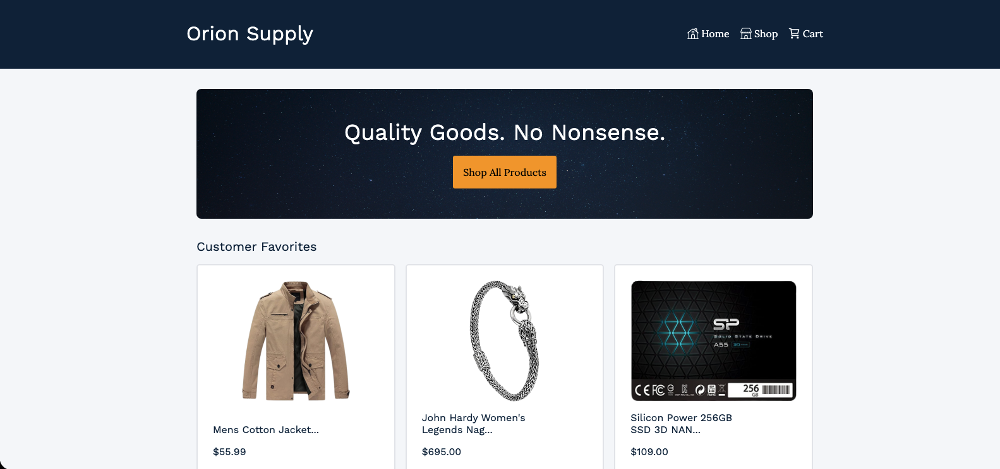
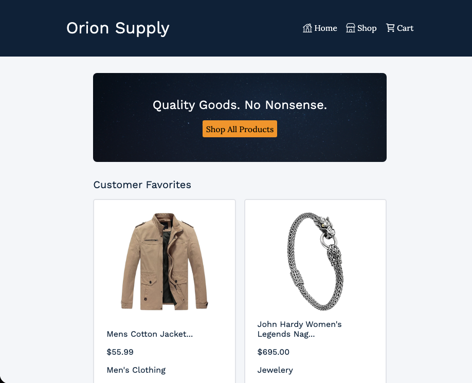
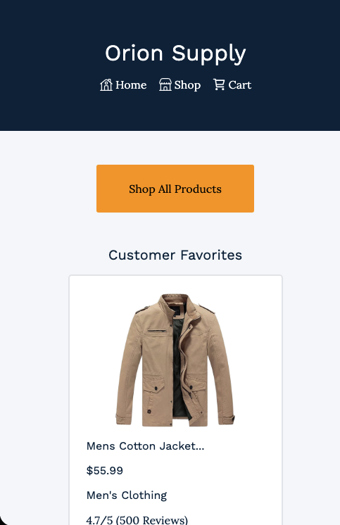

# 🛒 Mock Shopping Cart

Mock shopping cart and store front built for The Odin Project curriculum

## 👨‍💻 Technologies

- React
- React Router
- React Testing Library
- Vite
- Vitest
- CSS Modules
- npm

## ✨ Features

- Single Page Application (SPA) built with React Router
- Component testing using React Testing Library
- Automatically calculates total price of items in the cart
- Shortcut buttons in Home and Cart that navigate to the Shop page
- Responsive design for use on Desktop, Laptop, Tablet and Mobile

## 👨‍🎓 What I Learned

- How to test frontend components utilizing React Testing Library
- How to mock a fetch request
- How to mimic routing in tests using MemoryRouter
- How to route an SPA using React Router
- How to employ useOutletContext hook to consume Outlet context and share state with components
- How to employ CSS modules to scope local styles

## 🏃‍♂️ To Run

1. Clone Repo

```
git clone https://github.com/SamsDevLab/shopping-cart.git
cd shopping-cart
```

2. Ensure npm is installed

```
npm install
```

3. Run npm dev server

```
npm run dev
```

4. Open Vite Dev Server at [Local Host Server](http://localhost:5173/) in your browser

## Screenshots

### Desktop View



### Tablet View



### Mobile View


